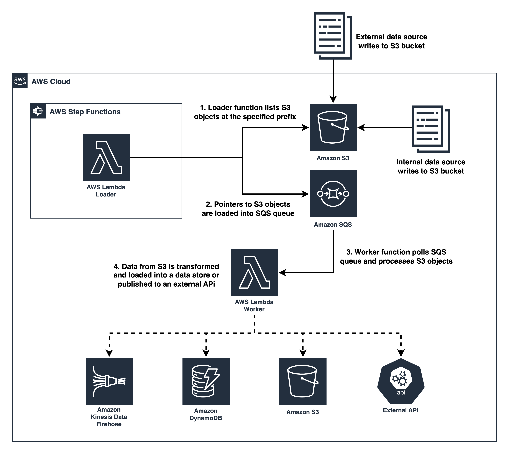

# s3-backfiller

* [Process Millions of Amazon S3 Objects](https://medium.com/@michaelsambol/process-millions-of-amazon-s3-objects-28e280ef9e0a)

## Architecture



## Deploy 

Software versions:
```
❯ node --version
v18.16.0

❯ python --version
Python 3.11.2

❯ cdk --version
2.79.1
```

Install dependencies:
```
npm install
```

You need Docker installed and running to package and deploy the Lambda function.

Deploy stack:
```
// dev
cdk deploy --context environment=dev S3BackfillerStack-dev

// add additional environments if desired
```

Invoking the state machine:
```
{
    "bucket": "<S3 BUCKET NAME>",
    "prefix": "<S3_PREFIX_WITH_FORWARD_SLASH>",
    "page_size": <Integer between 1 and 100>, // defaults to 500
    "queue_url": "<SQS_QUEUE_URL>" // defaults to queue deployed by CDK code
}
```
